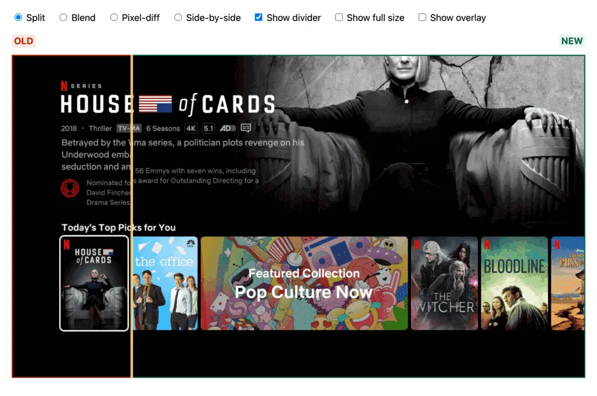
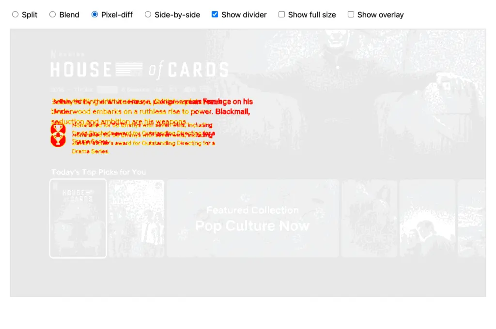
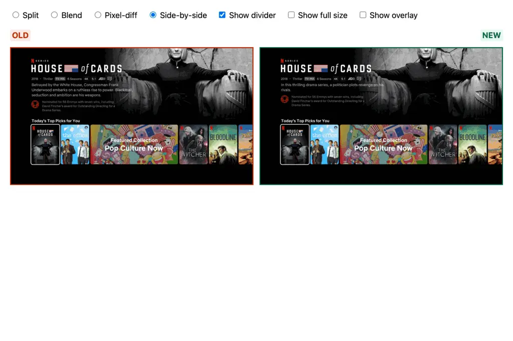
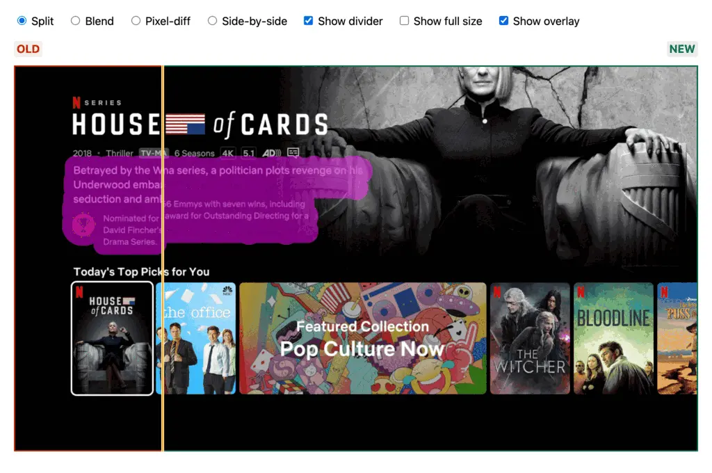
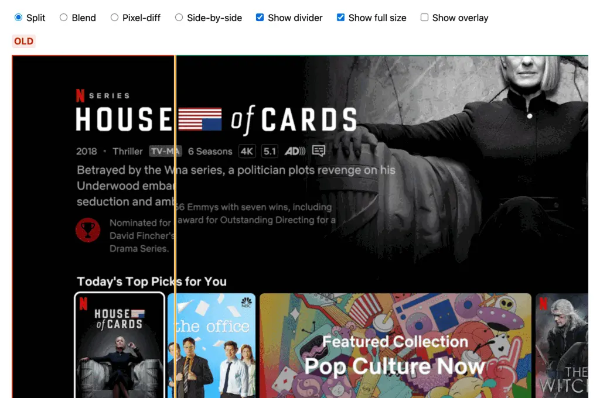
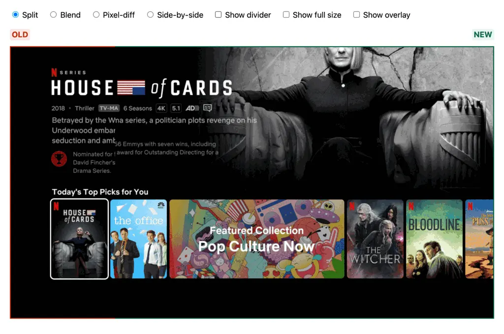

# react-image-diff

Zero-dependency React component providing different modes for diffing or comparing images. The image format is the same as that generated by `jest-image-snapshot`, a three part image with the order old-diff-new. All styles are inline for maximum portability.

## Four image comparison modes

### `split`

Drag a handle to view a split of old vs new

### `blend`

Using a native `input` slider, fade the new image over the old

### `pixel-diff`

Show the diff image directly

### `side-by-size`

Display both image side-by-size

## Configuration

### `showOverlay`

Generate a magenta overlay to highlight small changes.

### `showFullSize`

By default the component will reponsively fit the image into the container size. Set `showFullSize` to `true` to display the image at its full size.

### `showDivider`

Defaults to true. Shows an orange divider line between the old and new images in `split` mode. Set to `false` to hide.

