# react-image-diff

Zero-dependency React component providing different modes for diffing or comparing images. The image format is the same as that generated by `jest-image-snapshot`, a three part image with the order old-diff-new. All styles are inline for maximum portability.

## Image comparison modes

### `split`

Drag a handle to view a split of old vs new

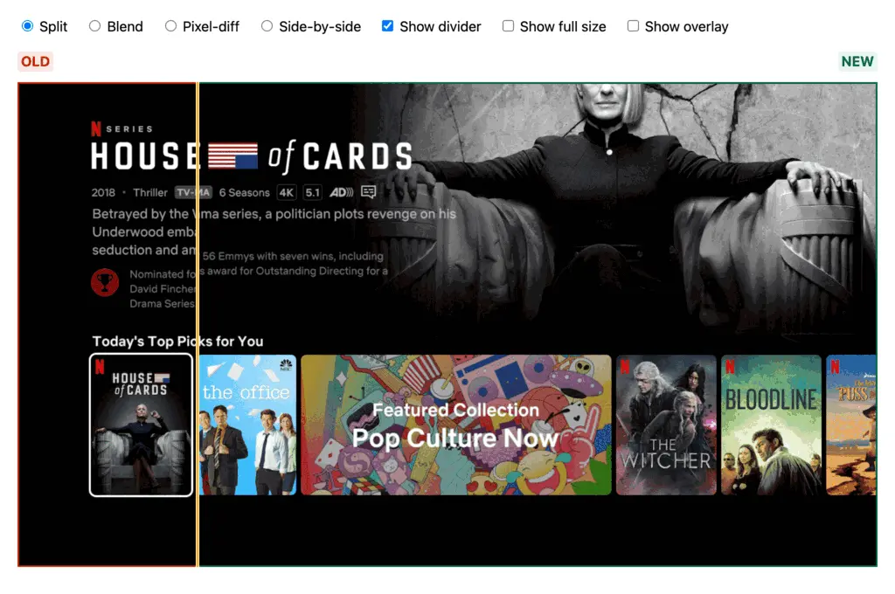

### `blend`

Using a native `input` slider, fade the new image over the old

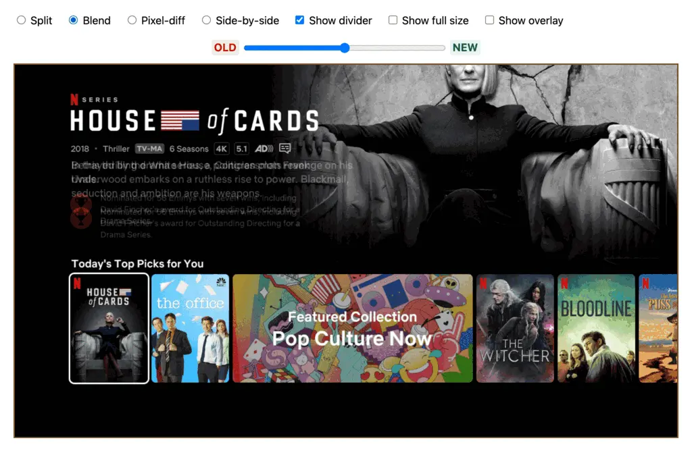

### `pixel-diff`

Show the diff image directly

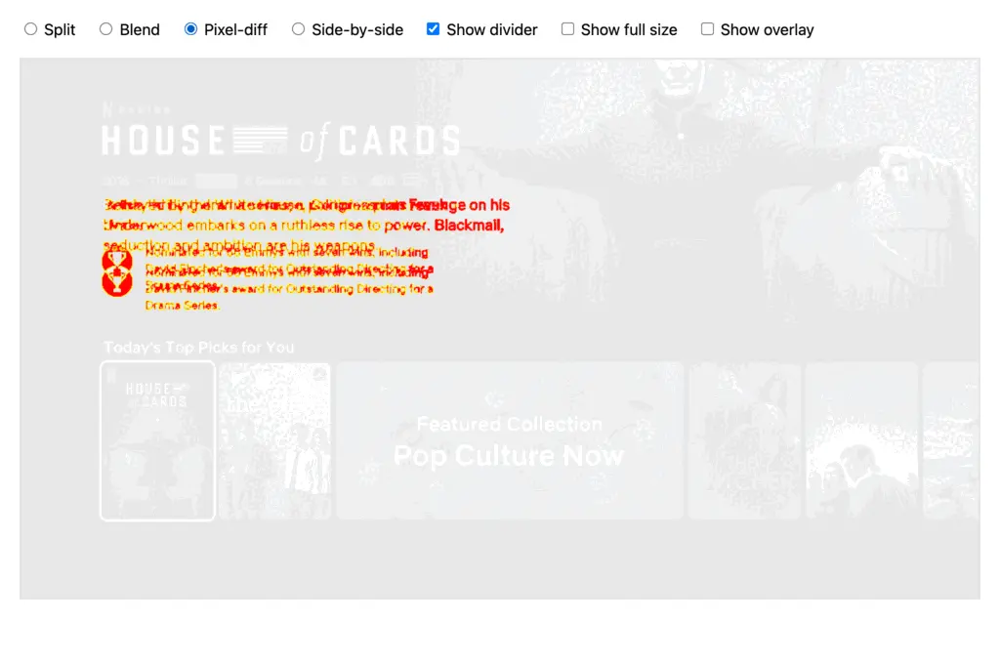

### `side-by-side`

Display both images side-by-side

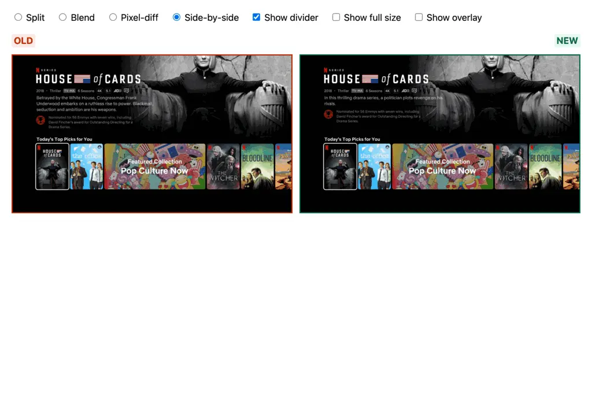

### `3-up`

Display old, diff, and new images side-by-side

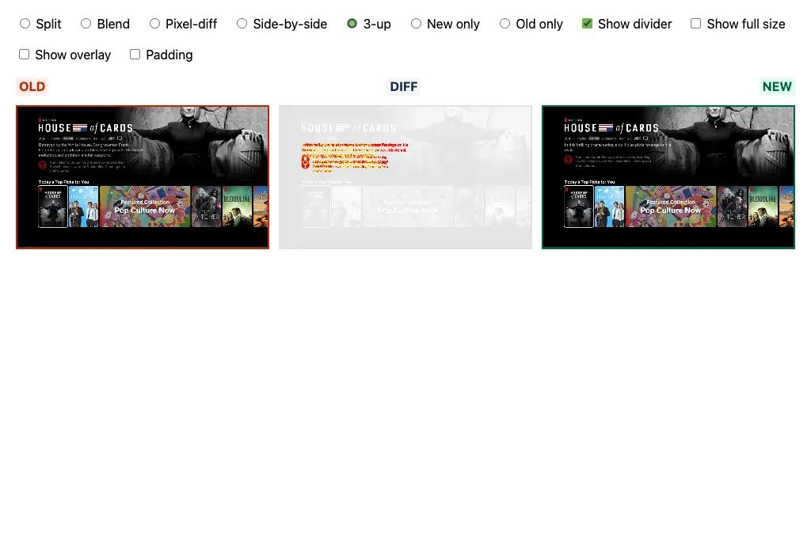

### `new-only`

Display only the new image

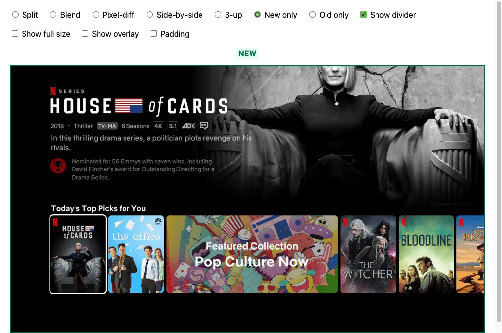

### `old-only`

Display only the old image

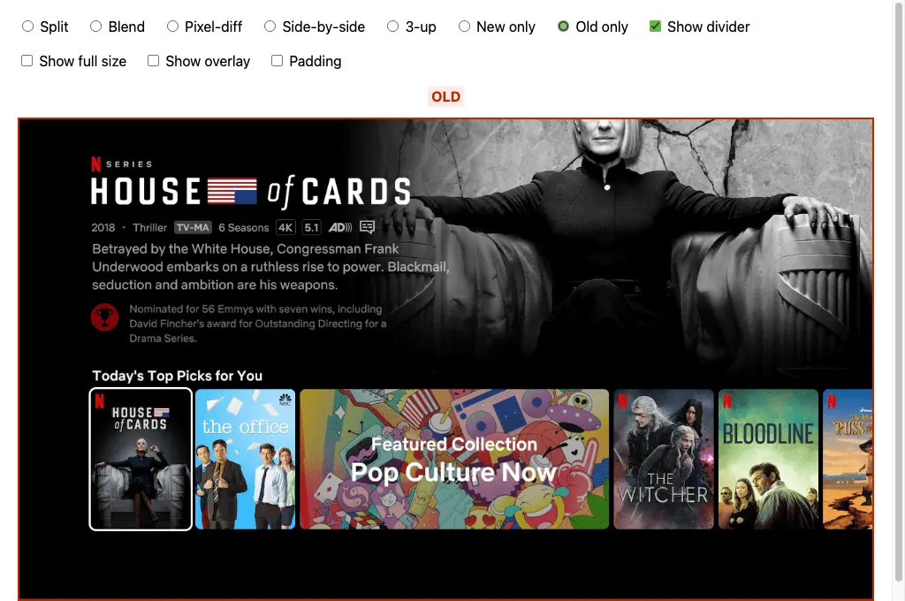

## Configuration

### `showOverlay`

Generate a magenta overlay to highlight small changes.

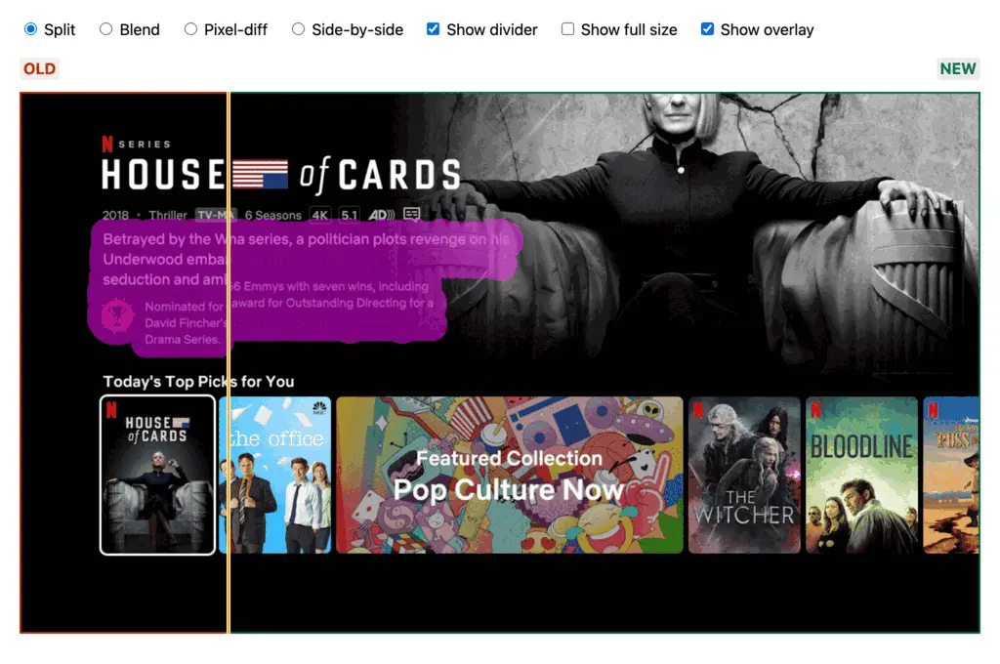

### `showFullSize`

By default the component will responsively fit the image into the container size. Set `showFullSize` to `true` to display the image at its full size.

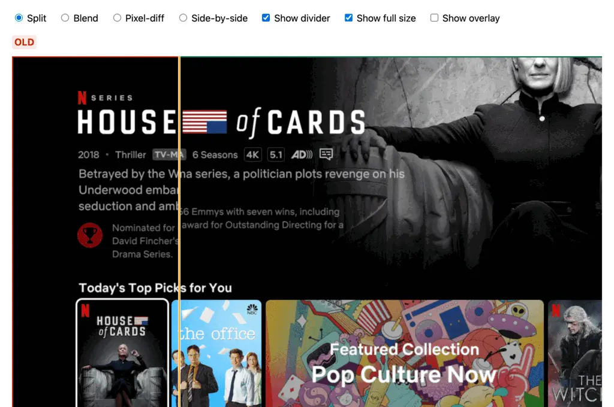

### `showDivider`

Defaults to true. Shows an orange divider line between the old and new images in `split` mode. Set to `false` to hide.

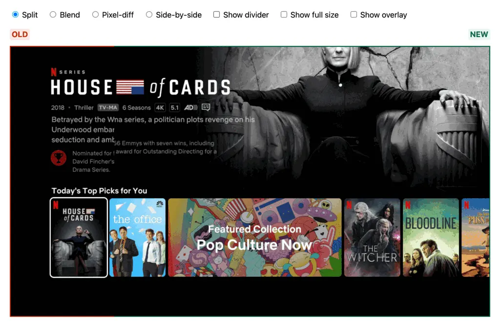

### `hasPadding`

Defaults to false. Adds padding around the images with a standard checkerboard pattern. Makes it easier to see the edges of the images.

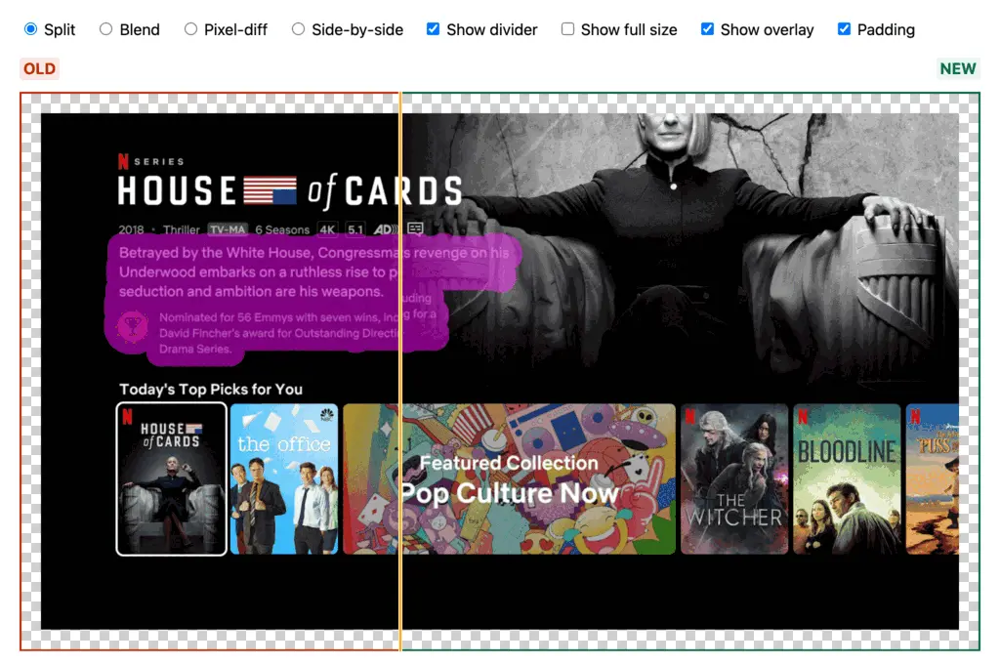

### `style`

Optional styles for the root wrapper `div`.

## Changelog

### 2.1.1

**Documentation:** Republished with changelog.

### 2.1.0

**Added:** `oldLabel`, `newLabel`, and `diffLabel` on `ImageDiff` now control the visible tag text in every comparison mode that shows labels (`3-up`, `side-by-side`, `split`, `blend`, `old-only`, `new-only`).

### 2.0.0

**Breaking change:** the root container no longer sets default `alignSelf`, `flexGrow`, `maxWidth`, or `overflow`. Those values interacted badly with some layouts, and full-size scrolling is better decided by the host. If you depended on the old behavior—for example in a flex column—recreate it with the `style` prop, for example:

```tsx
<ImageDiff
    url={url}
    style={{
        alignSelf: "stretch",
        flexGrow: 1,
        maxWidth: "100%",
        overflow: showFullSize ? "auto" : "hidden",
    }}
/>
```

## Building

```sh
npm run build
```

## Demo

Since `ImageDiff` does not include any configuration controls, the demo is a simple showcase of the modes and options.

```sh
npm run demo:watch
# another terminal
npm run demo:serve
# open http://localhost:3000
```
